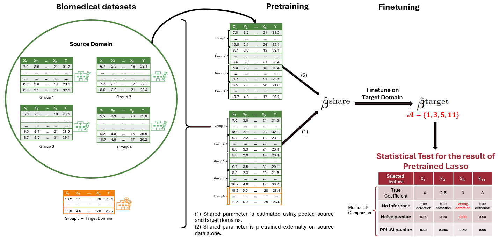
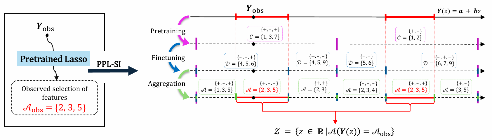

# PPL-SI: Post-Pretrained Lasso Statistical Inference

**PPL-SI** is a Python package designed to provide statistically valid inference for high-dimensional regression in transfer and distributed learning settings. It specifically targets the **Pretrained Lasso** and **D-TransFusion** algorithms, ensuring rigorous control of the False Positive Rate (FPR) while maintaining high statistical power (TPR).

The framework addresses the selection bias inherent in multi-stage training pipelines by explicitly characterizing the selection events and computing valid p-values conditioned on the model selection.

---

## 🖼️ Method Overview

### 1. The PPL-SI Framework
PPL-SI corrects the selection bias in the Pretrained Lasso pipeline (and its parameter-only/distributed variants). As shown below, naive p-values are often invalid (inflated Type I error), whereas PPL-SI successfully distinguishes between true signals and false positives.


*Figure 1: Demonstration of the proposed PPL-SI method.*

### 2. Divide-and-Conquer Strategy
To compute valid p-values, we identify the truncation region $\mathcal{Z}$ where the feature selection event remains invariant. PPL-SI employs an efficient **divide-and-conquer algorithm** to decompose the problem into sub-intervals, solving for linear inequalities in parallel.


*Figure 2: Schematic illustration of identifying the truncation region using a divide-and-conquer strategy.*

---

## 🚀 Features

- **Valid Inference for Transfer Learning**: Supports both **Pretrained Lasso** (data sharing) and **Parameter-Only Pretrained Lasso** (privacy-preserving).
- **Distributed Learning Support**: Extends selective inference to **D-TransFusion** (distributed one-shot transfer learning).
- **Exact FPR Control**: Theoretically guarantees control of the False Positive Rate at any significance level $\alpha$.
- **High-Performance Computing**: Implements a parallelized algorithm using `joblib` to handle high-dimensional data efficiently.

---

## 📦 Installation

### Prerequisites
The package requires Python 3.8+ and the following libraries:
- [`numpy`](https://numpy.org/doc/stable/)
- [`mpmath`](https://mpmath.org/) 
- [`skglm`](https://contrib.scikit-learn.org/skglm/) 
- [`scipy`](https://docs.scipy.org/doc/)
- [`joblib`](https://joblib.readthedocs.io/)


### Install from source
You can install the package in editable mode from the source code:

```bash
git clone https://github.com/DAIR-Group/PPL-SI.git
pip install -e .
```
---


## 📂 Package Structure
The repository is organized as follows:


```
PPL-SI/
├── ppl_si/                     # Source code package
│   ├── __init__.py             # Initialization
│   ├── PPL_SI.py               # Main inference engine (entry points)
│   ├── algorithms.py           # Estimators (Pretrained Lasso, D-TransFusion)
│   ├── sub_prob.py             # Solvers for sub-problem intervals (Lemma 3-7)
│   ├── gen_data.py             # Synthetic data generation
│   └── utils.py                # Helper functions 
│
├── examples/                   # Jupyter notebooks for demonstration
│   ├── ex1_p_value_PPL.ipynb   # Inference for Standard Pretrained Lasso
│   ├── ex2_p_value_PPL_parameter_only.ipynb # Inference for Parameter-Only transfer
│   ├── ex3_p_value_DTF.ipynb   # Inference for D-TransFusion
│   └── ex4_pivot.ipynb         # Validation of p-value uniformity (Pivot check)
│
├── figures/                    # Images for README/Documentation
└── README.md
```
